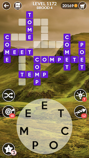
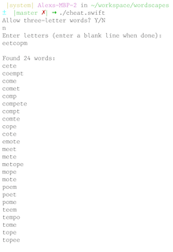

# Wordscapes Cheater




Wordscapes is a popular iOS word game, in which the player completes a crossword using only a given set of letters. The rules are simple:

- Each letter from the given set may be used only once; if a word has a certain letter twice, that letter must appear twice in the given set
- Words must be at least three letters long. Some games have a "no-threes" badge in the bottom-left corner, indicating that words must be at least four letters long.

Wordscapes Cheater is a simple command-line script that lets you cheat by finding all valid words for the given set of letters.

## Install

```bash
$ git clone https://github.com/alexbasson/wordscapes.git
$ cd wordscapes
```

## Usage

```bash
$ ./cheat.swift
Allow three-letter words? Y/N
n
Enter letters (enter a blank line when done):
abcabc

Found 2 words:
baba
bacca
```

## Swift goodness

Wordscapes Cheater is written in Swift and takes advantage of some of my favorite features of the language:


### Argument Labels and Parameter Names

[Naming is hard](https://www.martinfowler.com/bliki/TwoHardThings.html). In many languages, it's challenging to find names for a function and its parameters that are expressive both where the function is called and where it's implemented. Argument labels and parameter names allow you to write extremely expressive function APIs by decoupling the labels of the arguments passed into a function from the names of the parameters used in the function's implementation.

#### Example: String length in a range

For example, consider an extension function on `String` that returns a boolean indicating whether the string's length is within a given range.

#### No argument labels

Here's a definition that doesn't take advantage of argument labels:

```swift
extension String {
    func length(minLength: Int, maxLength: Int) -> Bool {
        return (self.count >= minLength) && (self.count <= maxLength)
    }
}
```

To see if `word` is between 3 and 5 characters, you call it like this:

```swift
word.length(minLength: 3, maxLength: 5)
```

The problem with this (other than it doesn't read like English) is that the API doesn't express whether the boundaries are inclusive. Does `"abcde".length(minLength: 3, maxLength: 5)` return `true` or `false`? Without looking at the implementation, it's hard to tell.

#### Bad parameter names

This definition tries to correct the ambiguous and poorly-reading API by using more expressive parameter names:

```swift
extension String {
    func length(isAtLeast: Int, andAtMost: Int) -> Bool {
        return (self.count >= isAtLeast) && (self.count <= andAtMost)
    }
}
```

Here's how you call it:

```swift
word.length(isAtLeast: 3, andAtMost: 5)
```

The API is much more expressive, but inside the body of the function, the use of `isAtLeast` and `andAtMost` makes the implementation less obvious.

#### Using argument labels AND parameters names

Finally, here's a definition that takes advantage of decoupled argument labels and parameter names. The argument labels are `isAtLeast` and `andAtMost`, while their corresponding parameter names are `minLength` and `maxLength`, respectively.

```swift
extension String {
    func length(isAtLeast minLength: Int, andAtMost maxLength: Int) -> Bool {
        return (self.count >= minLength) && (self.count <= maxLength)
    }
}
```

And here's how you call it:

```swift
word.length(isAtLeast: 3, andAtMost: 5)
```

This is much more expressive. It reads like English, and the API makes clear that the boundaries are, indeed, inclusive. We can now reasonably expect that `"abcde".length(isAtLeast: 3, andAtMost: 5)` to return `true`. Meanwhile, the implementation of the function is straightforward and obvious. Decoupled naming FTW!

